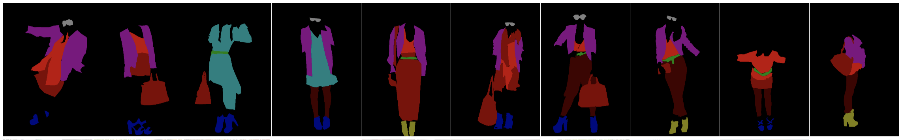

[](https://creativecommons.org/licenses/by-nc/4.0/)
# ModaNet


<details><summary>Table of Contents</summary><p>

* [Why we made ModaNet](#why-we-made-modanet)
* [Labels](#labels)
* [Contributing](#contributing)
* [Contact](#contact)
* [Citing ModaNet](#citing-modanet)
</p></details><p></p>


**ModaNet** is a street fashion images dataset consisting of annotations related to RGB images. ModaNet provides multiple polygon annotations for each image. This dataset is described in a technical paper with the title [`ModaNet: A Large-Scale Street Fashion Dataset with Polygon Annotations`](https://arxiv.org/pdf/1807.01394.pdf).
Each polygon is associated with a label from 13 meta fashion categories. The annotations are based on images in the [PaperDoll image set](https://github.com/kyamagu/paperdoll/tree/master/data/chictopia), which has only a few hundred images annotated by the superpixel-based tool. The contribution of ModaNet is to provide new and extra **polygon** annotations for the images.

Thanks to the [EvalAI team](https://evalAI.cloudcv.org), we have [ModaNet challenge leaderboard](https://evalai.cloudcv.org/web/challenges/challenge-page/151), please submit your best results there. It provides leaderboards for semantic segmentation, instance segmentation, and object detection, all in [COCO-style](http://cocodataset.org). We also provide the per-class IOU score for semantic segmentation task in stdout File. You might need to register an account in EvalAI. 

## Why we made ModaNet

ModaNet is intended to serve an educational purpose by providing a benchmark annotation set for emerging computer vision research including **semantic segmentation**, **object detection**, **instance segmentation**, **polygon detection**, and etc.

### Access to the annotations git repo
Please first install Git Large File Storage by following the below instructions. You might need to apply this step before you download the sql file from paperdoll repo.
```
https://help.github.com/articles/installing-git-large-file-storage/
```

Then you should git clone the repo along with the annotation files, otherwise the annotation files would not be downloaded directly using `git clone`.

```
git clone git@github.com:eBay/modanet.git 
```

Before you start working on the dataset, please verify the annotation files by using `md5sum`. In Mac, this requires you to run the following command:
```
md5 modanet2018_instances_train.json
```
you should expect to see the following md5 value:
```
MD5 (modanet2018_instances_train.json) = 96478657d20e322e9d3282c6d73c0c4c
```
If you apply the same command to check the val annotation, you should expect to see:
```
MD5 (modanet2018_instances_val.json) = 900b24b7d6c0c48203e6244f45d65499
```

Notice the file size:
```
modanet2018_instances_train.json (101MB)
modanet2018_instances_val.json (210KB)
```

### Labels
Each polygon (bounding box, segmentation mask) annotation is assigned to one of the following labels:

| Label | Description | Fine-Grained-categories |
| --- | --- | --- |
| 1 | bag | bag |
| 2 | belt | belt |
| 3 | boots | boots |
| 4 | footwear | footwear |
| 5 | outer | coat/jacket/suit/blazers/cardigan/sweater/Jumpsuits/Rompers/vest |
| 6 | dress | dress/t-shirt dress |
| 7 | sunglasses | sunglasses |
| 8 | pants | pants/jeans/leggings |
| 9 | top | top/blouse/t-shirt/shirt |
|10 | shorts | shorts |
|11 | skirt | skirt |
|12 | headwear | headwear |
|13 | scarf & tie | scartf & tie |

The annotation data format of ModaNet follows the same style as [COCO-dataset](http://cocodataset.org).


#### Data format
```
{
'info' : info, 'images' : [image], 'annotations' : [annotation], 'licenses' : [license],'year': year, 'categories': [category], 'type': type
}

info{
'version' : str, 'description' : str, 'contributor' : str, 'date_created' : datetime,
}

image{
'id' : int, 'width' : int, 'height' : int, 'file_name' : str, 'license' : int
}

license{
'id' : int, 'name' : str, 'url' : str,
}

annotation{
  'area': int, 
  'bbox': [x,y,width,height],
  'segmentation': [polygon],
  'image_id': int,
  'id': int,
  'category_id': int,
  'iscrowd': int
}
category{
  'supercategory': str, 'id': int, 'name': str,
}
```

#### Submitting results to leaderboard

You can participate only the Object Detection task by submitting results as follows

```
[{
'image_id' : int, 'category_id' : int, 'bbox' : [x,y,width,height], 'score' : float,
}]
```
Example
```
[{'bbox': [192, 30, 20, 28],
  'category_id': 13,
  'image_id': 100014,
  'score': 0.8}]
```

You can participate only the Instance Segmentation/Semantic Segmentation/Polygon prediction tasks by submitting results as follows
```
[{
'image_id' : int, 'category_id' : int, 'segmentation' : polygon, 'score' : float,
}]
```

Example
```
[{'segmentation': [[210,
    31,
    212,
    35,
    204,
    37,
    204,
    45,
    205,
    54,
    199,
    58,
    194,
    52,
    198,
    42,
    192,
    32,
    194,
    30,
    201,
    33]],
  'category_id': 13,
  'image_id': 100014,
  'score': 0.8 }]
```

You can participate the task of joint detection and segmentation by submitting results as follows


```
[{
'image_id' : int, 'category_id' : int, 'segmentation' : polygon, 'score' : float, 'bbox' : [x,y,width,height]
}]
```
Example
```
[{'bbox': [192, 30, 20, 28],
  'category_id': 13,
  'image_id': 100014,
  'segmentation': [[210,
    31,
    212,
    35,
    204,
    37,
    204,
    45,
    205,
    54,
    199,
    58,
    194,
    52,
    198,
    42,
    192,
    32,
    194,
    30,
    201,
    33]],
  'score': 0.8}]
```

We acknowledge the contribution of COCOdataset team and all the format would follow the same style as those in the COCOdataset. Check [COCOAPI](https://github.com/cocodataset/cocoapi).

## Contributing
You are more than welcome to contribute to this github repo! Either by submitting a bug report, or providing feedback about this dataset. Please open issues for specific tasks or post to the contact Google group below.


## Contact
To discuss the dataset, please contact [Moda-net Google Group](https://groups.google.com/forum/#!forum/moda-net).


## Citing ModaNet
If you use ModaNet, we would appreciate reference to the following paper:

Shuai Zheng, Fan Yang, M. Hadi Kiapour, Robinson Piramuthu. ModaNet: A Large-Scale Street Fashion Dataset with Polygon Annotations. ACM Multimedia, 2018. [PDF 5.7MB](https://arxiv.org/pdf/1807.01394.pdf)


Biblatex entry:
```
@inproceedings{zheng/2018acmmm,
  author       = {Shuai Zheng and Fan Yang and M. Hadi Kiapour and Robinson Piramuthu},
  title        = {ModaNet: A Large-Scale Street Fashion Dataset with Polygon Annotations},
  booktitle    = {ACM Multimedia},
  year         = {2018},
}
```
## License
This annotation data is released under the [Creative Commons Attribution-NonCommercial license 4.0](https://creativecommons.org/licenses/by-nc/4.0/).


